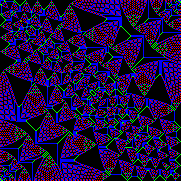

# Abelian Sandpile Model

[](https://github.com/FredrikMeyer/abeliansandpile/actions/workflows/rust.yml)

How to run:

```shell
RUSTFLAGS="-C target-cpu=native" cargo build --bin abeliansandpile --release
```

Then 
```shell
time ./target/release/abeliansandpile 200 40000 
```

~~(at the moment this takes about 15 minutes)~~ (takes 1.7 seconds after optimizations)

Which produces the following:



Also this:


## Optimizations

Found many useful tips in the [Rust Performance Book](https://nnethercote.github.io/perf-book/title-page.html).

Use the `rustc-hash` provided `FxHashSet` instead of the built-in `HashSet`. Gave almost double performance.

Comnpile with `RUSTFLAGS="-C target-cpu=native"`.

## Sources 

Computations on sandpile models in SAGE
https://doc.sagemath.org/html/en/thematic_tutorials/sandpile.html#introduction

https://mathoverflow.net/a/149934

Chip-Firing and Rotor-Routing on Directed Graphs
> We give a rigorous and self-contained survey of the abelian sandpile model and rotor-router model on finite directed graphs, highlighting the connections between them. We present several intriguing open problems.
https://arxiv.org/abs/0801.3306

gif https://docs.rs/gif/latest/gif/

Apollonian structure in the Abelian sandpile
> The Abelian sandpile process evolves configurations of chips on the integer lattice by toppling any vertex with at least 4 chips, distributing one of its chips to each of its 4 neighbors. When begun from a large stack of chips, the terminal state of the sandpile has a curious fractal structure which has remained unexplained. Using a characterization of the quadratic growths attainable by integer-superharmonic functions, we prove that the sandpile PDE recently shown to characterize the scaling limit of the sandpile admits certain fractal solutions, giving a precise mathematical perspective on the fractal nature of the sandpile.
https://arxiv.org/abs/1208.4839


Pattern formation in growing sandpiles
https://arxiv.org/abs/0808.1732

Primer for the algebraic geometry of sandpiles
https://arxiv.org/abs/1112.6163

Publications of Wesley Pegden
https://www.math.cmu.edu/~wes/pub.html

## Similar projects 

Animation of steps one by one (also have an idea on how to parallellize)
https://github.com/jamais-vu/sandpile

Python implementation
https://github.com/kivyfreakt/sandpile

https://pi.math.cornell.edu/~levine/gallery/


https://people.reed.edu/~davidp/sand/program/program.html
